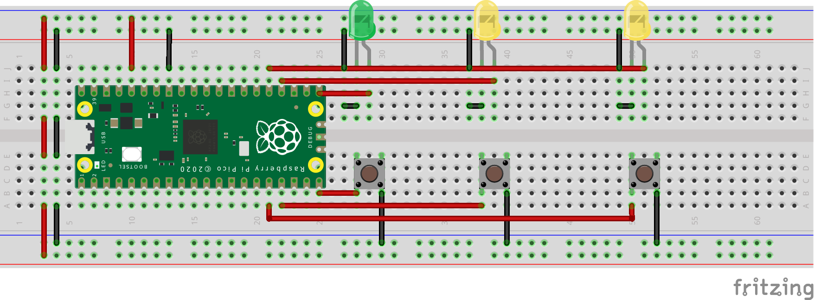

<h1 align="center">Juego de Reacción - Raspberry Pi Pico 🎮 </h1>

Este es un proyecto que implementa un juego de velocidad de reacción en una Raspberry Pi Pico utilizando MicroPython.

## Descripción

Este es un emocionante juego de velocidad de reacción. Cuando se presione el botón "Start" ⏯️, el juego comenzará. Los dos jugadores 👥 deben mantenerse atentos al indicador LED (GP16) 💡. Cuando este se ilumine, los jugadores deberán presionar rápidamente su botón correspondiente 🚀. El jugador que presione primero será declarado como el ganador 🏆, y su LED quedará encendido para señalar su victoria. Para iniciar un nuevo juego, simplemente presiona nuevamente el botón "Start" ⏯️. ¡Diviértete! 🎉

## Materiales

- Raspberry Pi Pico
- 3 Leds de colores (A preferencia del usuario)
- 3 pulsadores normalmente abiertos
- Protoboard
- Cables de conexión

## Conexiones

| Pin | Descripcion |
| --- | ----------- |
| GP12 | Botón Jugador 1 |
| GP13 | Botón Jugador 2 |
| GP15 | Botón Start |
| GP16 | Led Indicador |
| GP18 | Led Jugador 1 |
| GP19 | Led Jugador 2 |

```
En la Raspberry, todos los pulsadores están configurados internamente como PULL UP, lo que 
significa que no es necesario hacer una configuración resistiva adicional.

Dado que la salida de voltaje de la Raspberry es de 3V, no es necesario proteger los LED 
con resistencias adicionales.
```
## Diagrama




[](https://github.com/ycanas)


